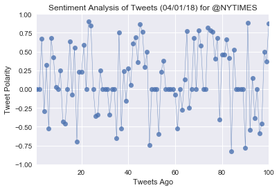

```python
# Dependencies
import numpy as np
import pandas as pd
import matplotlib.pyplot as plt
import json
import tweepy
import time
import seaborn as sns
import matplotlib.pyplot as plt
from datetime import datetime

# Initialize Sentiment Analyzer
from vaderSentiment.vaderSentiment import SentimentIntensityAnalyzer
from confi import consumer_key,consumer_secret,access_token,access_token_secret
analyzer = SentimentIntensityAnalyzer()

# Setup Tweepy API Authentication
auth = tweepy.OAuthHandler(consumer_key, consumer_secret)
auth.set_access_token(access_token, access_token_secret)
api = tweepy.API(auth, parser=tweepy.parsers.JSONParser())
```


```python
# Target Account
#BBC, CBS, CNN, Fox, and New York times
news = ['@BBC', '@CBS', '@CNN', '@Fox', '@NYTIMES'] 
#target_user = "@SouthwestAir"


# Variables for holding sentiments
sentiments = []

 # Get all tweets from home feed
for new in news:
    # Counter
    counter = 1
    public_tweets = api.user_timeline(new, page=x+1, count=100)

# Loop through 5 pages of tweets (total 100 tweets)
    #for x in range(5):


        # Loop through all tweets 
    for tweet in public_tweets:

            # Print Tweets
            # print("Tweet %s: %s" % (counter, tweet["text"]))

            # Run Vader Analysis on each tweet
            compound = analyzer.polarity_scores(tweet["text"])["compound"]
            pos = analyzer.polarity_scores(tweet["text"])["pos"]
            neu = analyzer.polarity_scores(tweet["text"])["neu"]
            neg = analyzer.polarity_scores(tweet["text"])["neg"]
            tweets_ago = counter
            new = tweet['user']['screen_name']
            text = tweet["text"]

            # Add sentiments for each tweet into an array
            sentiments.append({"Date": datetime.strptime(tweet["created_at"], "%a %b %d %H:%M:%S %z %Y"),
                               "Compound": compound,
                               "Positive": pos,
                               "Negative": neu,
                               "Neutral": neg,
                               "Tweets Ago": counter,
                               "News":new,
                               "Text": text})

            # Add to counter 
            counter = counter + 1
        
        
      

```


```python
# Convert sentiments to DataFrame
sentiments_pd = pd.DataFrame.from_dict(sentiments)

sentiments_pd.head()
```


<div>
<style scoped>
    .dataframe tbody tr th:only-of-type {
        vertical-align: middle;
    }

    .dataframe tbody tr th {
        vertical-align: top;
    }

    .dataframe thead th {
        text-align: right;
    }
</style>
<table border="1" class="dataframe">
  <thead>
    <tr style="text-align: right;">
      <th></th>
      <th>Compound</th>
      <th>Date</th>
      <th>Negative</th>
      <th>Neutral</th>
      <th>News</th>
      <th>Positive</th>
      <th>Text</th>
      <th>Tweets Ago</th>
    </tr>
  </thead>
  <tbody>
    <tr>
      <th>0</th>
      <td>0.0000</td>
      <td>2018-03-13 20:00:05+00:00</td>
      <td>1.000</td>
      <td>0.000</td>
      <td>BBC</td>
      <td>0.00</td>
      <td>Wakanda has Black Panther. \n\n Senegal has Sa...</td>
      <td>1</td>
    </tr>
    <tr>
      <th>1</th>
      <td>0.0000</td>
      <td>2018-03-13 19:00:05+00:00</td>
      <td>1.000</td>
      <td>0.000</td>
      <td>BBC</td>
      <td>0.00</td>
      <td>⚔ Charis is 19 years old and makes SWORDS for ...</td>
      <td>2</td>
    </tr>
    <tr>
      <th>2</th>
      <td>0.0000</td>
      <td>2018-03-13 18:30:05+00:00</td>
      <td>1.000</td>
      <td>0.000</td>
      <td>BBC</td>
      <td>0.00</td>
      <td>Microplastics are littering riverbeds across t...</td>
      <td>3</td>
    </tr>
    <tr>
      <th>3</th>
      <td>0.6696</td>
      <td>2018-03-13 17:30:06+00:00</td>
      <td>0.710</td>
      <td>0.000</td>
      <td>BBC</td>
      <td>0.29</td>
      <td>❤️💃🏻 Ballet is STILL the love of Joyce's life ...</td>
      <td>4</td>
    </tr>
    <tr>
      <th>4</th>
      <td>-0.2960</td>
      <td>2018-03-13 17:16:46+00:00</td>
      <td>0.913</td>
      <td>0.087</td>
      <td>BBC</td>
      <td>0.00</td>
      <td>RT @bbcthree: "No one needs airbags because yo...</td>
      <td>5</td>
    </tr>
  </tbody>
</table>
</div>


```python
sentiments_pd.to_csv("sentiment_analysis.csv", index=False)
```


```python
#['@BBC', '@CBS', '@CNN', '@Fox', '@NYTIMES'] 

tweets_ago=sentiments_pd.loc[sentiments_pd['News']=='BBC']['Tweets Ago']
tweets_compound=sentiments_pd.loc[sentiments_pd['News']=='BBC']['Compound']
print(tweets_ago.values)
print(tweets_compound.values)
```

    [  1   2   3   4   5   6   7   8   9  10  11  12  13  14  15  16  17  18
      19  20  21  22  23  24  25  26  27  28  29  30  31  32  33  34  35  36
      37  38  39  40  41  42  43  44  45  46  47  48  49  50  51  52  53  54
      55  56  57  58  59  60  61  62  63  64  65  66  67  68  69  70  71  72
      73  74  75  76  77  78  79  80  81  82  83  84  85  86  87  88  89  90
      91  92  93  94  95  96  97  98  99 100]
    [ 0.      0.      0.      0.6696 -0.296   0.3182 -0.5255  0.6808  0.4215
      0.0258  0.      0.25   -0.431  -0.4588  0.      0.6304 -0.0772  0.5515
     -0.7003  0.2263  0.2263  0.5859  0.      0.9022  0.8429  0.     -0.3612
     -0.34    0.25    0.      0.      0.     -0.34    0.      0.     -0.6542
      0.7579 -0.5255  0.2433 -0.1531  0.2732  0.0516  0.6068  0.6908  0.3612
      0.861   0.765   0.296   0.4939 -0.7481  0.      0.      0.     -0.5994
      0.2263  0.3818  0.      0.      0.      0.     -0.0772 -0.5267  0.
     -0.2755  0.1326  0.7717 -0.25    0.      0.6808  0.      0.7847  0.5803
      0.      0.      0.8176  0.784   0.765   0.4019  0.6783 -0.4019  0.4588
      0.4605  0.6588  0.4106 -0.8316  0.5267  0.      0.      0.      0.
     -0.7783  0.8805 -0.5411  0.1511 -0.3818  0.     -0.5859 -0.4588  0.4926
      0.3724]
    


```python
# Create plot
plt.plot(np.arange(len(sentiments_pd["Compound"])),
         sentiments_pd["Compound"], marker="o", linewidth=0.5,
         alpha=0.8)

plt.xlim(np.min(tweets_ago),np.max(tweets_ago)) 
plt.ylim([-1,1])

# # Incorporate the other graph properties
plt.title("Sentiment Analysis of Tweets (%s) for %s" % (time.strftime("%x"), news[0]))
plt.ylabel("Tweet Polarity")
plt.xlabel("Tweets Ago")

plt.savefig('bbc.png')
plt.show()
```


```python
tweets_ago=sentiments_pd.loc[sentiments_pd['News']=='CBS']['Tweets Ago']
tweets_compound=sentiments_pd.loc[sentiments_pd['News']=='CBS']['Compound']
print(tweets_ago.values)
print(tweets_compound.values)
```

    [  1   2   3   4   5   6   7   8   9  10  11  12  13  14  15  16  17  18
      19  20  21  22  23  24  25  26  27  28  29  30  31  32  33  34  35  36
      37  38  39  40  41  42  43  44  45  46  47  48  49  50  51  52  53  54
      55  56  57  58  59  60  61  62  63  64  65  66  67  68  69  70  71  72
      73  74  75  76  77  78  79  80  81  82  83  84  85  86  87  88  89  90
      91  92  93  94  95  96  97  98  99 100]
    [ 0.8718  0.6597  0.3818  0.743   0.7222  0.      0.5423  0.1139  0.7644
      0.      0.3818  0.5719  0.      0.6808  0.875   0.8957  0.7569  0.
      0.5093  0.8527  0.7798  0.25    0.1867  0.5423  0.6114  0.5106  0.
      0.5093  0.      0.5562  0.555   0.8832  0.4939 -0.2263 -0.2263  0.0772
      0.      0.5754  0.6476  0.8126  0.7777  0.5423  0.3182  0.1511  0.4199
      0.5106  0.      0.3612  0.9217  0.5213 -0.5655  0.9466  0.5994  0.7906
      0.8689  0.8016  0.5719  0.      0.25    0.      0.      0.8591 -0.2263
      0.5574  0.3612  0.4588  0.807   0.4574 -0.2263  0.8271  0.7783  0.8658
      0.8516  0.7897  0.6166  0.1867  0.6996 -0.3595  0.3612  0.4199  0.7707
      0.      0.8221  0.      0.      0.      0.6893  0.1901  0.296   0.
      0.6115  0.      0.6808  0.3612  0.     -0.3595  0.6239  0.      0.5542
      0.    ]
    


```python
# Create plot
plt.plot(np.arange(len(sentiments_pd["Compound"])),
         sentiments_pd["Compound"], marker="o", linewidth=0.5,
         alpha=0.8)

plt.xlim(np.min(tweets_ago),np.max(tweets_ago)) 
plt.ylim([-1,1])

# # Incorporate the other graph properties
plt.title("Sentiment Analysis of Tweets (%s) for %s" % (time.strftime("%x"), news[1]))
plt.ylabel("Tweet Polarity")
plt.xlabel("Tweets Ago")

plt.savefig('cbs.png')
plt.show()
```


```python
tweets_ago=sentiments_pd.loc[sentiments_pd['News']=='CNN']['Tweets Ago']
tweets_compound=sentiments_pd.loc[sentiments_pd['News']=='CNN']['Compound']
print(tweets_ago.values)
print(tweets_compound.values)
```

    [  1   2   3   4   5   6   7   8   9  10  11  12  13  14  15  16  17  18
      19  20  21  22  23  24  25  26  27  28  29  30  31  32  33  34  35  36
      37  38  39  40  41  42  43  44  45  46  47  48  49  50  51  52  53  54
      55  56  57  58  59  60  61  62  63  64  65  66  67  68  69  70  71  72
      73  74  75  76  77  78  79  80  81  82  83  84  85  86  87  88  89  90
      91  92  93  94  95  96  97  98  99 100]
    [-0.3182  0.0516 -0.4588 -0.4767  0.17    0.7096  0.4215  0.      0.
      0.      0.25    0.      0.3818 -0.4404  0.      0.2732 -0.5267  0.
      0.      0.      0.      0.      0.     -0.3182  0.6369  0.6808 -0.6124
      0.2732 -0.7783  0.      0.2023 -0.8126  0.     -0.3052  0.25    0.
      0.3384 -0.4767  0.     -0.7461  0.3612 -0.296   0.5994  0.      0.0772
      0.      0.      0.      0.      0.     -0.3182  0.      0.5719 -0.765
     -0.7845  0.5267 -0.5574  0.2263  0.      0.      0.5267 -0.5267  0.
      0.      0.     -0.5106 -0.7906  0.4497  0.5719  0.6486  0.6808  0.
      0.34    0.0258  0.      0.1531  0.4588  0.      0.     -0.6597  0.
     -0.296   0.      0.      0.3612  0.     -0.3164  0.2732 -0.5667 -0.5574
      0.7378 -0.6705  0.      0.34   -0.8658  0.      0.     -0.34    0.
      0.    ]
    


```python
# Create plot
plt.plot(np.arange(len(sentiments_pd["Compound"])),
         sentiments_pd["Compound"], marker="o", linewidth=0.5,
         alpha=0.8)

plt.xlim(np.min(tweets_ago),np.max(tweets_ago)) 
plt.ylim([-1,1])

# # Incorporate the other graph properties
plt.title("Sentiment Analysis of Tweets (%s) for %s" % (time.strftime("%x"), news[2]))
plt.ylabel("Tweet Polarity")
plt.xlabel("Tweets Ago")

plt.savefig('cnn.png')
plt.show()
```


```python
tweets_ago=sentiments_pd.loc[sentiments_pd['News']=='fox']['Tweets Ago']
tweets_compound=sentiments_pd.loc[sentiments_pd['News']=='fox']['Compound']
print(tweets_ago.values)
print(tweets_compound.values)
```

    [  1   2   3   4   5   6   7   8   9  10  11  12  13  14  15  16  17  18
      19  20  21  22  23  24  25  26  27  28  29  30  31  32  33  34  35  36
      37  38  39  40  41  42  43  44  45  46  47  48  49  50  51  52  53  54
      55  56  57  58  59  60  61  62  63  64  65  66  67  68  69  70  71  72
      73  74  75  76  77  78  79  80  81  82  83  84  85  86  87  88  89  90
      91  92  93  94  95  96  97  98  99 100]
    [ 0.     -0.2732  0.4199  0.3612  0.      0.      0.7096 -0.1531  0.5106
     -0.6696  0.1531  0.4738  0.4199  0.5994  0.5807  0.4199  0.4767 -0.4588
      0.      0.7875  0.      0.4404 -0.5423  0.6115  0.      0.624   0.
      0.2732  0.6496  0.      0.     -0.5859  0.      0.      0.9371  0.6808
      0.      0.4767  0.2732  0.2244  0.3182  0.5093  0.      0.      0.296
      0.6369 -0.7096 -0.3612 -0.5095 -0.4215  0.      0.6204  0.0772 -0.296
      0.6114 -0.5927  0.      0.7906  0.7713  0.3612  0.      0.765   0.128
      0.296   0.     -0.3182  0.     -0.4367  0.3612  0.      0.4451  0.
      0.128  -0.5106  0.2263 -0.0377  0.      0.      0.      0.4767  0.3612
      0.      0.      0.      0.5574  0.4926  0.8286 -0.3182  0.     -0.4767
      0.4939  0.7579  0.      0.34   -0.2282 -0.6249  0.      0.      0.4754
      0.4003]
    


```python
# Create plot
plt.plot(np.arange(len(sentiments_pd["Compound"])),
         sentiments_pd["Compound"], marker="o", linewidth=0.5,
         alpha=0.8)

plt.xlim(np.min(tweets_ago),np.max(tweets_ago)) 
plt.ylim([-1,1])

# # Incorporate the other graph properties
plt.title("Sentiment Analysis of Tweets (%s) for %s" % (time.strftime("%x"), news[3]))
plt.ylabel("Tweet Polarity")
plt.xlabel("Tweets Ago")

plt.savefig('fox.png')
plt.show()
```


```python
tweets_ago=sentiments_pd.loc[sentiments_pd['News']=='nytimes']['Tweets Ago']
tweets_compound=sentiments_pd.loc[sentiments_pd['News']=='nytimes']['Compound']
print(tweets_ago.values)
print(tweets_compound.values)
```

    [  1   2   3   4   5   6   7   8   9  10  11  12  13  14  15  16  17  18
      19  20  21  22  23  24  25  26  27  28  29  30  31  32  33  34  35  36
      37  38  39  40  41  42  43  44  45  46  47  48  49  50  51  52  53  54
      55  56  57  58  59  60  61  62  63  64  65  66  67  68  69  70  71  72
      73  74  75  76  77  78  79  80  81  82  83  84  85  86  87  88  89  90
      91  92  93  94  95  96  97  98  99 100]
    [ 0.     -0.5106  0.5106  0.7964 -0.4404  0.      0.      0.5267 -0.296
     -0.7713  0.1531 -0.8625  0.4404 -0.4404  0.4019 -0.3182 -0.5859  0.
     -0.6124  0.      0.3182 -0.6486  0.      0.3612  0.      0.      0.4854
      0.3182  0.4767 -0.296  -0.296   0.      0.2013  0.      0.4215  0.5563
      0.34    0.      0.      0.296   0.      0.802   0.      0.      0.
      0.      0.     -0.4588 -0.4767 -0.8625  0.296  -0.6908  0.      0.6908
     -0.296  -0.5423 -0.6369  0.      0.3612  0.6808 -0.6619  0.6249  0.
      0.2023  0.4404  0.     -0.7778  0.      0.      0.7783  0.2263 -0.8625
     -0.6705  0.6597  0.      0.      0.     -0.8834  0.5563 -0.296   0.5267
      0.      0.     -0.6486  0.5775  0.5719 -0.296   0.3182 -0.6808  0.6908
      0.     -0.3182  0.      0.      0.      0.      0.4404  0.      0.4019
      0.    ]
    


```python
# Create plot
plt.plot(np.arange(len(sentiments_pd["Compound"])),
         sentiments_pd["Compound"], marker="o", linewidth=0.5,
         alpha=0.8)

plt.xlim(np.min(tweets_ago),np.max(tweets_ago)) 
plt.ylim([-1,1])

# # Incorporate the other graph properties
plt.title("Sentiment Analysis of Tweets (%s) for %s" % (time.strftime("%x"), news[4]))
plt.ylabel("Tweet Polarity")
plt.xlabel("Tweets Ago")

plt.savefig('nytime.png')
plt.show()
```





```python
colors = {"BBC": "lightblue",
          "CBS":"green", 
          "CNN":"red",
          "fox":"blue",
          "nytimes": "yellow"}

sns.set()

plt.xlabel("Tweets Ago")
plt.ylabel("Tweet Polarity")
plt.title("Sentiment Analysis of Media Tweets (%s)" % (time.strftime("%m/%d/%Y")))

#Loop through the keys in the dictionary to get the corresponding colours for each news media
for info in colors.keys():
    sent = sentiments_pd[sentiments_pd['News'] == info]
    plt.scatter(sent["Tweets Ago"],sent["Compound"], label = info, color = colors[info], edgecolor = "black", alpha=0.8)
plt.legend(title = 'Media Sources', bbox_to_anchor=(1, 1))    
plt.savefig('sentbubble.png')
plt.show()

```


```python
mean_com =  {
    "BBC" : np.mean(sentiments_pd.loc[sentiments_pd['News']=='BBC']['Compound']), 
    "CBS" : np.mean(sentiments_pd.loc[sentiments_pd['News']=='CBS']['Compound']),
    "CNN" : np.mean(sentiments_pd.loc[sentiments_pd['News']=='CNN']['Compound']),
    "fox": np.mean(sentiments_pd.loc[sentiments_pd['News']=='fox']['Compound']),
    "nytimes": np.mean(sentiments_pd.loc[sentiments_pd['News']=='nytimes']['Compound']) }
```


```python
plt.bar(mean_com.keys(), mean_com.values(), color = ['#00FFFF', '#008000', '#ff0000', '#0000ff', '#FFFF00'])
plt.title("Overall Media Sentiment Based on Twitter (%s)" % (time.strftime("%m/%d/%Y")))
plt.ylabel("Tweet Polarity")
plt.savefig('bar_chart.png')
plt.show()
```


